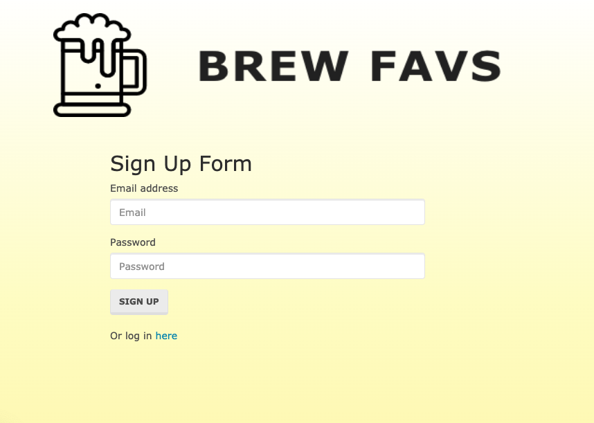
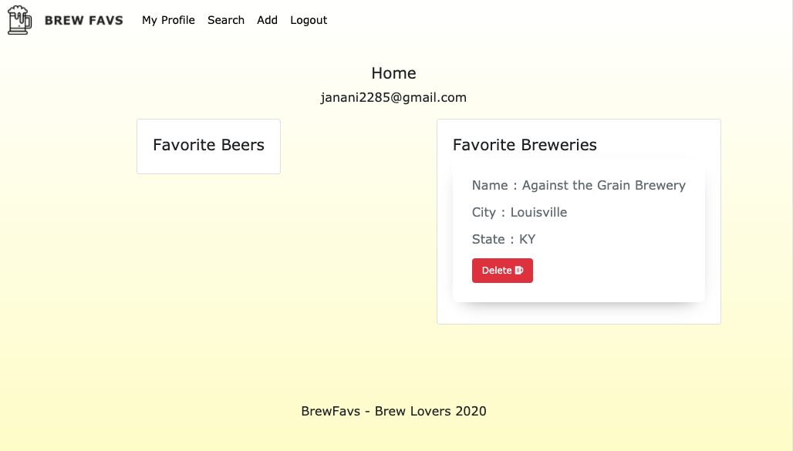
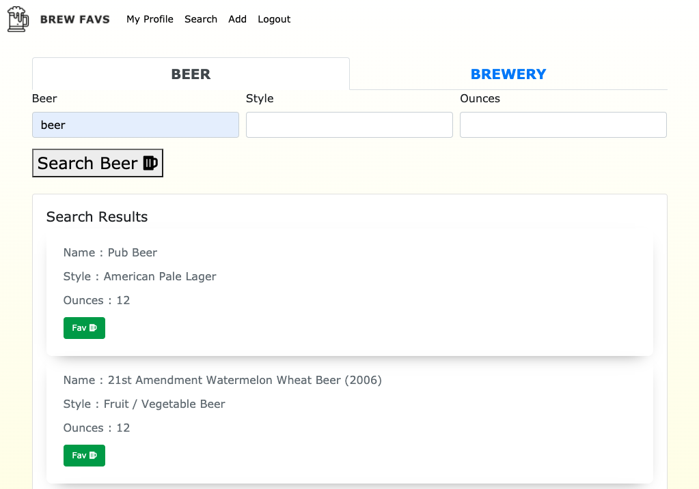
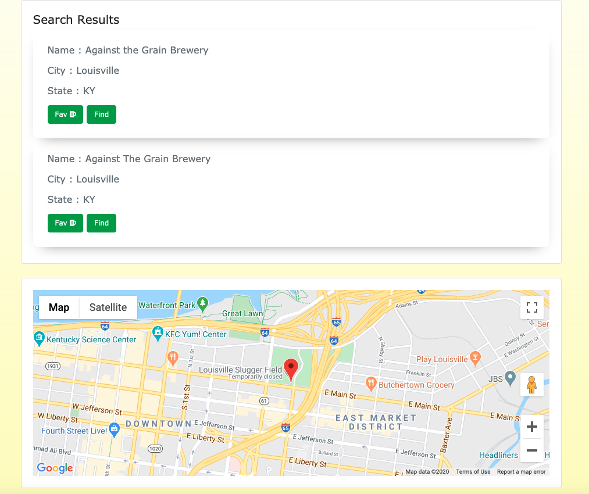
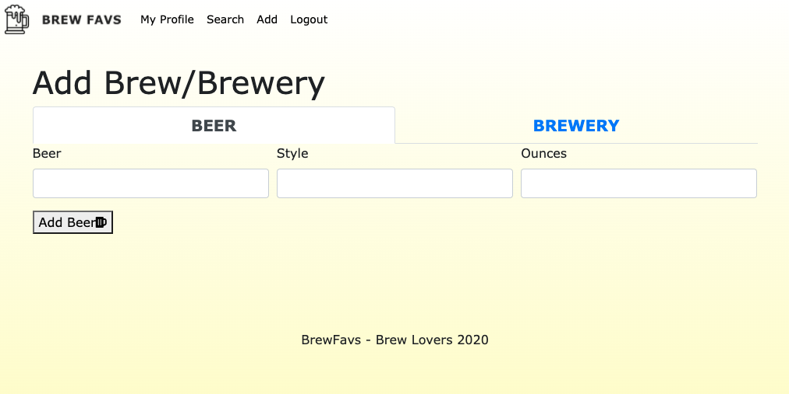

# BREW FAV's

## Description 

An app for beer lovers which allows them to  create a profile, search for beers and breweries, and save their favorites!

The technologies user are as follows:

- Front-end
    - UI: HTML
    - Styles: CSS, Bootstrap, FontAwesome, Adobe Illustrator
    - Client Side logic : jQuery
    - Map related functionality : Google Places

- Back-end:
    - Server side logic : node.js
    - Npm packages used : express, handlebars, sequelize, mysql2, passport

- Database: MySql 

## Table of Contents 

* [Installation](#installation)
* [Usage](#usage)
* [Credits](#credits)
* [License](#license)
* [Screenshot](#screenshot)


## Installation

1. Create a database named - "brewFav_db"
2. Execute ``` npm install ``` command in terminal(Mac) or command promt(windows) to install all needed packages to run this application successfully.
3. Run ``` npm run seeds ``` command in terminal(Mac) or command promt(windows) to create the tables in database, establish the association between models and insert bulk data.
4. Run ``` npm run start ``` command in terminal(Mac) or command promt(windows) to start the application.


## Usage 

https://brewfavs.herokuapp.com/


## Credits

1. Timothy Ober 
2. Janani Nagaraj Amutha
3. Chris Gonzales
4. Diana Chen


## License

Uses MIT license


## Screenshot

### Signup page:
<br>

### Profile page:
<br>

### Search page:
<br>

### Search page with map:
<br>

### Add page:
<br>

